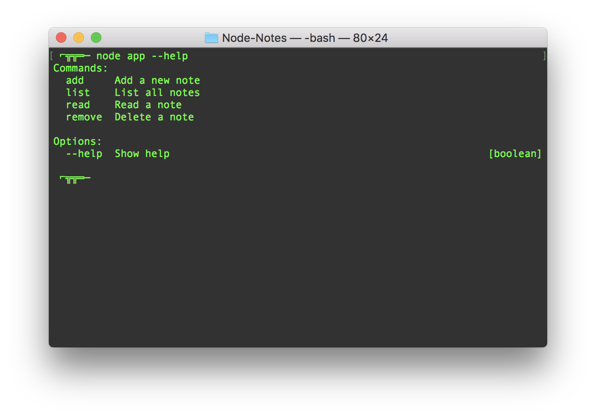
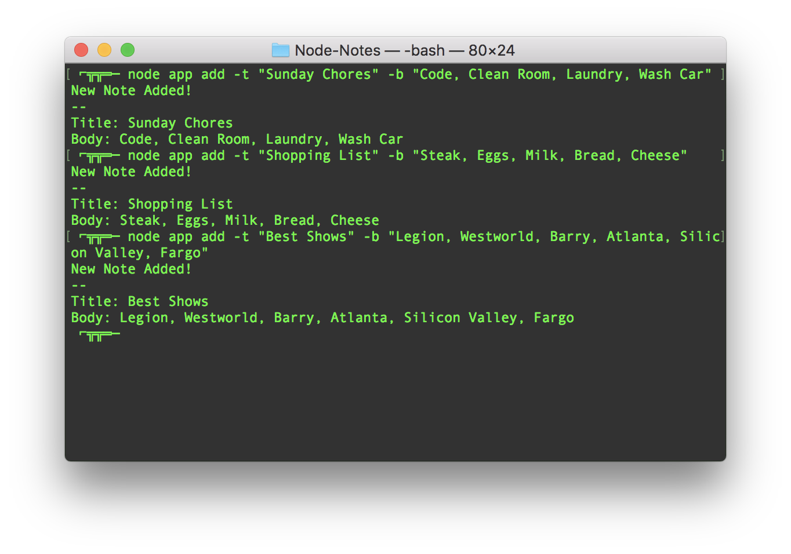
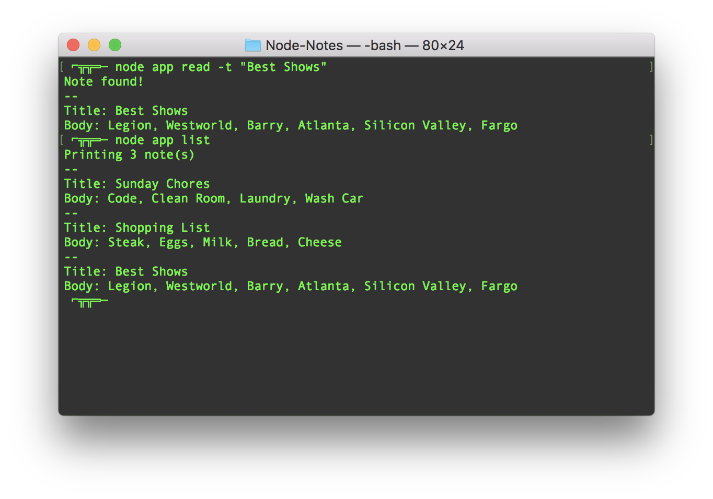
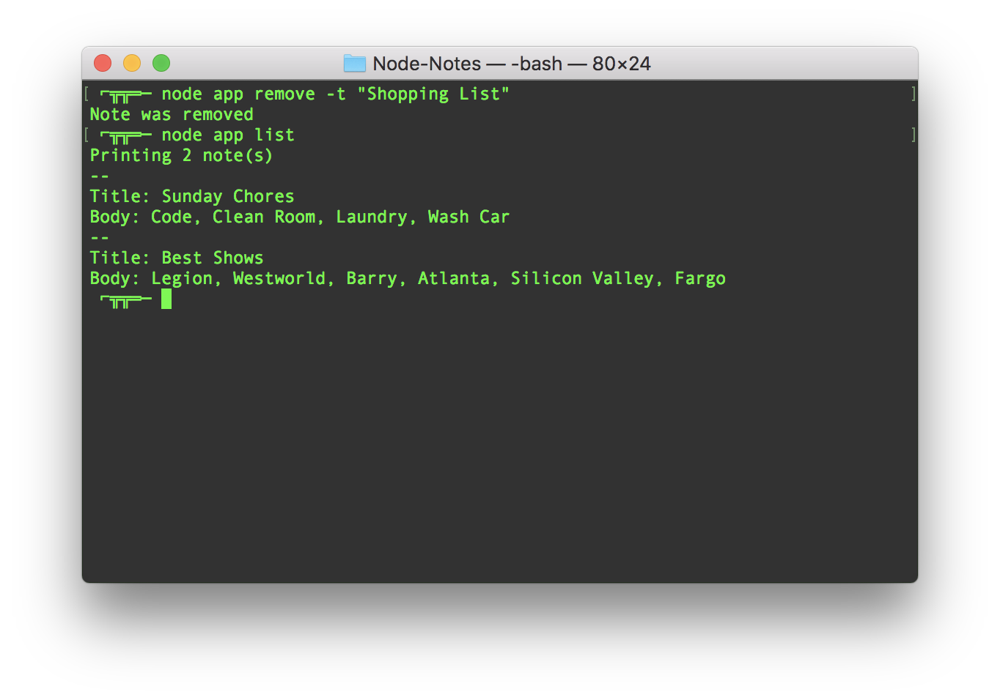

# Node-Notes
This is a simple command line notes app made with NODE. The app requires fs, lodash, and yargs. Inside the terminal the user can add, read, list, and delete notes. All of the changes and updates are saved to a JSON file. The yargs package is used to parse the users command line arguments to make the app function smoothly and set requirements for each command line input the user enters. 

---

- The first thing the user can do is run the --help argument to get a list of the different commands that they can run to use the app and make it work. The commands are: add, list, read, and remove.

- The user can run the 'add' command to add a new note to thier notes list. The command required the -t argument to add a title to the note, and a -b command to specify the body of the note. After filling out the information they will get a message that the note was added as well as the content of the new note displayed to the console.

- There are two ways the user can take a look at thier notes. The first is to search for a single note by entering the 'read' command followed by the title of the note they are looking for. The second is by running the 'list' command and listing the content of every note saved.

- The user can delete a note they no longer have use for by entering the 'remove' command followed by the title of the note they would like deleted from the notes list.

